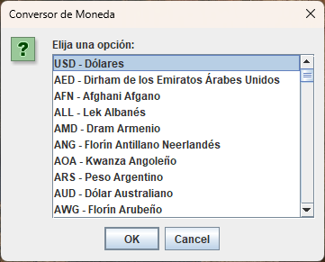

# Currency and Temperature Converter in Java

## Description

This Java program implements two converters: a **Currency Converter** and a **Temperature Converter**. The user can select which type of conversion they want to perform between different international currencies or temperature scales.

## Currency Converter

### Description

The **Currency Converter** allows the user to convert an amount of money between different international currencies. The program displays a dialog box that offers options to select the source and target currencies and then prompts the user to enter the amount they wish to convert.

### Functionality

1. The program displays a dialog box with options for the user to choose between "Currency Converter," "Temperature Converter," or "Exit." If the user selects "Exit," a farewell message is shown, and the program terminates.

2. If the user chooses "Currency Converter," two dialog boxes are shown to select the source and target currencies for the conversion.

3. The program then prompts the user to enter the amount in the source currency.

4. It converts the entered amount to US dollars (USD) using the conversion factor associated with the source currency.

5. It further converts the amount from US dollars (USD) to the target currency using the conversion factor associated with the target currency.

6. The result of the conversion is displayed in a dialog box.

7. The program asks the user if they want to continue converting currencies. If the user chooses to continue, the process is repeated. If the user chooses not to continue, a farewell message is shown, and the program terminates.

## Temperature Converter

### Description

The **Temperature Converter** allows the user to convert a temperature between Celsius, Fahrenheit, and Kelvin scales. The program displays a dialog box that offers options to select the source and target temperature scales and then prompts the user to enter the temperature value to convert.

### Functionality

1. The program displays a dialog box with options for the user to choose between "Currency Converter," "Temperature Converter," or "Exit." If the user selects "Exit," a farewell message is shown, and the program terminates.

2. If the user chooses "Temperature Converter," two dialog boxes are shown to select the source and target temperature scales for the conversion.

3. The program then prompts the user to enter the temperature value to convert.

4. It converts the entered temperature to the target temperature scale using the appropriate conversion formulas based on the selected scales.

5. The result of the conversion is displayed in an informative dialog box.

6. The program asks the user if they want to continue converting temperatures. If the user chooses to continue, the process is repeated. If the user chooses not to continue, a farewell message is shown, and the program terminates.

## Used Classes

### CurrencyConverter

- Main class that contains the `main()` method to execute the currency converter.
- Uses the `Currency` class (defined elsewhere in the code) to obtain currency options for conversion.
- Implements the logic to perform currency conversion and display the results in dialog boxes.

### Currency

- Class that represents a currency with its attributes (code, name, and conversion factor).
- Provides getter and setter methods to access and modify the attributes.
- Overrides the `toString()` method to obtain a readable representation of the currency.
- Contains a static method `getCurrencies()` that returns a list of `Currency` objects representing the different currencies available for conversion.

### TemperatureConverter

- Main class that contains the `main()` method to execute the temperature converter.
- Defines an enumeration `TemperatureScale` to represent temperature scales (Celsius, Fahrenheit, and Kelvin).
- Implements the logic to perform temperature conversion and display the results in dialog boxes.

## Screenshots

1. 
2. 
3. 
4. 
5. 
6. 
7. 
8. 
9. 
10. 

## Conclusions

This program provides a simple yet effective functionality for performing currency and temperature conversions. The list of available international currencies for conversion is extensive and allows users to convert between various currencies from around the world. The temperature converter functionality covers conversions between Celsius, Fahrenheit, and Kelvin scales, providing a useful tool for working with different temperature unit systems.

**Note**: For the program to work correctly, ensure that the `Currency` class is defined elsewhere in the code and provides currencies and their conversion factors. Additionally, keep in mind that currency exchange rates should be updated based on current rates to obtain accurate results in currency conversions.